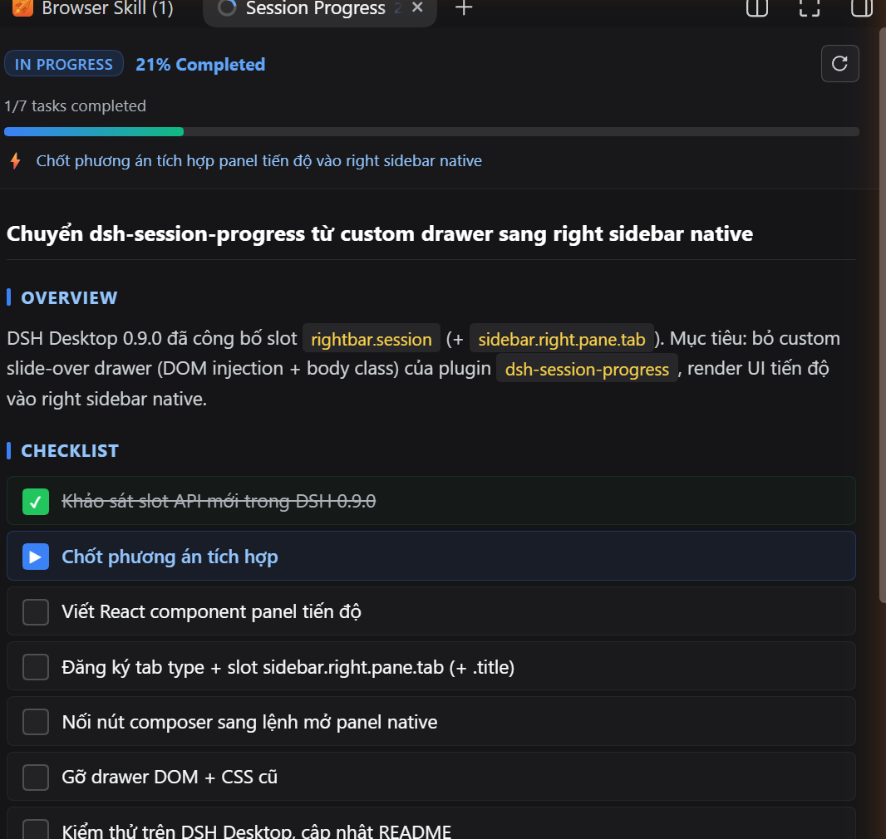
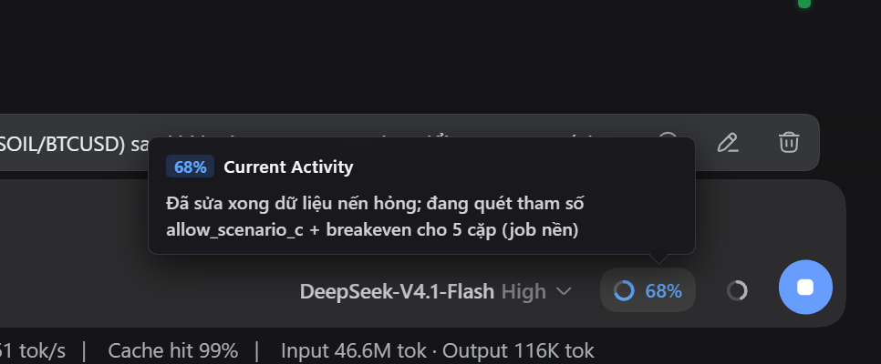

# dsh-session-progress

[English](README.md) | [Tiếng Việt](README.vn.md)

---

## 1. Purpose & Overview

<p align="center">
  
</p>

<p align="center">
  
</p>

**dsh-session-progress** is a real-time session progress and task tracking plugin for **DeepSeek Harness (DSH / DSH Desktop)**.

In long-running or complex agentic sessions, it is often challenging for users to quickly determine the overall completion status, active subtasks, or upcoming milestones without sifting through extensive conversation logs. 

**dsh-session-progress** solves this by:
- **System Prompt Injection**: Automatically injects prompt instructions that direct the AI Agent to maintain a structured Markdown progress file in the OS temporary directory (`os.tmpdir()`).
- **Structured YAML Frontmatter & Dual-Engine % Calculation**:
  - Automatically extracts progress percentage, execution status (`starting`, `in_progress`, `blocked`, `completed`), and the active step from the file's YAML frontmatter.
  - Automatically falls back to parsing standard Markdown task checklists (`- [x]`, `- [/]`, `- [ ]`) if frontmatter is omitted.
- **Adaptive Language Alignment**: Instructs the Agent to match the conversation language (e.g., Vietnamese, English) for all section headers, checklists, and task summaries while maintaining English YAML keys.
- **Composer Toolbar Live Button & Activity Tooltip**: Mounts directly into DSH's composer input toolbar (adjacent to the Model Selector & Context Meter), featuring a sleek circular SVG progress ring, real-time percentage badge, and an interactive popover showing the active task.
- **Slide-over Side Drawer**: Opens a smooth 440px right-side panel featuring:
  - A visual gradient progress bar and active status indicators.
  - Formatted Markdown viewer with rendered checkboxes and highlighted sections.
  - Quick action buttons to open the raw file in the OS default editor (VS Code, Notepad) or trigger instant refresh.

---

## 2. Installation Guide

### For DSH Desktop

#### Windows (PowerShell)
```powershell
cd "$env:APPDATA\dsh-desktop\harness\profiles\web"
& "$env:APPDATA\dsh-desktop\harness\.desktop-bin\pnpm.cmd" add https://github.com/nguyenduclong-ict/dsh-session-progress
```

#### macOS (Terminal)
```bash
cd "$HOME/Library/Application Support/dsh-desktop/harness/profiles/web"
"$HOME/Library/Application Support/dsh-desktop/harness/.desktop-bin/pnpm" add https://github.com/nguyenduclong-ict/dsh-session-progress
```

#### Linux (Terminal)
```bash
cd "$HOME/.config/dsh-desktop/harness/profiles/web"
"$HOME/.config/dsh-desktop/harness/.desktop-bin/pnpm" add https://github.com/nguyenduclong-ict/dsh-session-progress
```

> **Note**: Restart **DSH Desktop** after installation to activate the plugin.

---

### For DSH CLI (Standalone)

Run the following command in your terminal:

```bash
dsh plugin --profile web add https://github.com/nguyenduclong-ict/dsh-session-progress
```

Or install directly within your Cordis workspace profile:

```bash
pnpm add https://github.com/nguyenduclong-ict/dsh-session-progress
```

---

## 3. Sample Markdown Structure

```markdown
---
progress: 65%
status: in_progress
current_activity: "Running test suites"
---

# Session Progress: <Goal Title>

## Overview
<Brief summary of session objective and current status>

## Checklist
- [x] Step 1 completed
- [/] Step 2 currently executing
- [ ] Step 3 pending

## Current Activity
<Details of what is currently executing>

## Next Steps
<Planned immediate actions>

## Key Findings / Notes
<Important takeaways, metrics, or blocker alerts>
```

---

## License

MIT © [nguyenduclong-ict](https://github.com/nguyenduclong-ict)
