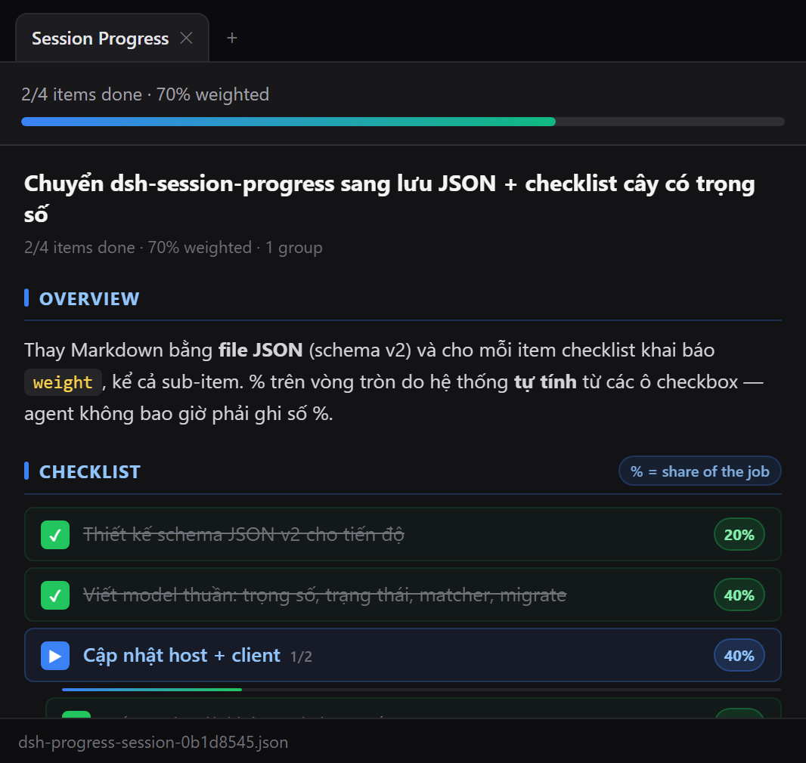
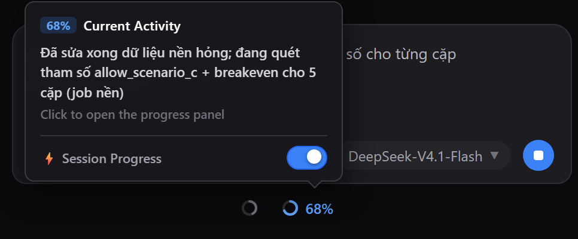

# dsh-session-progress

[English](README.md) | [Tiếng Việt](README.vn.md)

---

## 1. Purpose & Overview

<p align="center">
  
</p>

<p align="center">
  
</p>

**dsh-session-progress** is a real-time session progress and task tracking plugin for **DeepSeek Harness (DSH / DSH Desktop)**.

In long-running or complex agentic sessions, it is often challenging for users to quickly determine the overall completion status, active subtasks, or upcoming milestones without sifting through extensive conversation logs.

### How it appears

The plugin renders **inside DSH's own right sidebar** — it does not draw an overlay of its own, so it never fights the frame for space:

| Surface | Where it lives |
| --- | --- |
| Progress ring + `%` pill | The composer trailing toolbar, beside the context meter |
| Progress panel | A native right sidebar tab named **Session Progress** |

Clicking the composer control (or the *Click to open the progress panel* hint in its popover) opens that tab and reveals the right column. Being an ordinary sidebar tab, it docks, floats, splits, and follows the session exactly like Files or the document preview.

> **Requirement**: the right sidebar tab slots (`rightbar.session`, `sidebar.right.pane.tab`) must exist in your DSH build — DSH Desktop 0.9.0 or newer.
>
> **Compatibility note (v0.11.1)**: progress is now stored as a **JSON document** instead of Markdown, and the checklist is a **nested, weighted tree**. Every item declares a `weight`, so the percentage on the ring is *computed* from the boxes — the agent never writes a number again. A v0.10.x Markdown progress file is migrated to JSON automatically the first time its session is read, checklist included. The composer trigger is hidden on the new-conversation screen (there is nothing to report yet), and the panel sections are drawn with the original accent-bar headings.
>
> **Compatibility note (v0.10.6)**: DSH Desktop 0.10.0 (harness 0.1.7) renamed the session id source and prefixed session ids with `session-`. The client now reads the current session through `uiSession` and the host accepts either id spelling, while the 0.9.x/0.10.0 shapes both stay supported.

---

## 2. The progress document

One JSON file per session (`dsh-progress-<session>-<uuid>.json`, in the system temp directory) holds the whole document:

```json
{
  "version": 2,
  "title": "Ship the weighted JSON progress format",
  "status": "in_progress",
  "currentActivity": "Rewrite the host",
  "overview": "Storage moves from Markdown to JSON.",
  "checklist": [
    { "text": "Design the schema", "weight": 20, "state": "done",    "children": [] },
    { "text": "Rewrite the host",  "weight": 30, "state": "running", "children": [] },
    { "text": "Ship the panel",    "weight": 50, "state": "pending", "children": [
      { "text": "Render the tree",  "weight": 25, "state": "pending", "children": [] },
      { "text": "Show the weights", "weight": 25, "state": "pending", "children": [] }
    ] }
  ],
  "nextSteps": "1. Update the README",
  "notes": "schema = v2"
}
```

### How the percentage is computed

`weight` is an item's share **among its siblings**, normalized so every group is worth 100%:

```
share(item) = share(parent) × weight(item) / Σ weight(siblings)
```

Both readings of the example above therefore agree: three top-level weights (`20 / 30 / 50`, i.e. percent of the job) and two sub-weights (`25 / 25`, summing to their parent's `50`). An item with no weight counts as `1`, and a group may not mix declared and defaulted child weights.

Progress of a node: a leaf counts `1` when `done`, `½` when `running`, `0` when `pending`; a group is the weighted average of its children and its own `state` is derived — checking a group off cascades `done` into its whole subtree. `status` is derived too (all leaves done ⇒ `completed`, any progress ⇒ `in_progress`, nothing started ⇒ `starting`); `blocked` is the only status a caller sets.

### Agent-facing tools

| Tool | Purpose |
| --- | --- |
| `session_progress_status` | Cheapest first look of a turn: the current activity, the step in progress, the pending steps after it and the plan. |
| `session_progress_check_done` | Finish the step in progress: tick it, promote the next `[ ]` step to running, recompute the percentage. |
| `session_progress_write` | Create the document (`content`) or patch it (`checklist` + `checklist_mode`, `add`, `update`, `check`, `start`, `uncheck`, `remove`, and the prose fields). |
| `session_progress_read` | Read the whole document, or only the sections you name. |

No tool accepts a percentage — it always follows the boxes.

### Good to know

- Weights are normalized, so re-weighting one item changes its siblings' shares. Read `weightPercent` back from `session_progress_read` / `session_progress_status` when an exact split matters.
- An item may nest up to 6 levels; a document holds at most 400 items and should stay under ~40 KB.
- A matcher (`#3` = displayed row, `#2.1` = path, or a text snippet) must resolve to exactly one item. An unknown or ambiguous matcher is refused, with the full item list, and nothing is written.
- The panel prints each item's computed share as a `%` badge, so a declared weight and the number on screen can never disagree.

---

## 3. Installation Guide

### For DSH Desktop

#### Windows (PowerShell)
```powershell
cd "$env:APPDATA\dsh-desktop\harness\profiles\web"
& "$env:APPDATA\dsh-desktop\harness\.desktop-bin\pnpm.cmd" add https://github.com/nguyenduclong-ict/dsh-session-progress
```

#### macOS (Terminal)
```bash
cd "$HOME/Library/Application Support/dsh-desktop/harness/profiles/web"
"$HOME/Library/Application Support/dsh-desktop/harness/.desktop-bin/pnpm" add https://github.com/nguyenduclong-ict/dsh-session-progress
```

#### Linux (Terminal)
```bash
cd "$HOME/.config/dsh-desktop/harness/profiles/web"
"$HOME/.config/dsh-desktop/harness/.desktop-bin/pnpm" add https://github.com/nguyenduclong-ict/dsh-session-progress
```

> **Note**: Restart **DSH Desktop** after installation to activate the plugin.

---

### For DSH CLI (Standalone)

Run the following command in your terminal:

```bash
dsh plugin --profile web add https://github.com/nguyenduclong-ict/dsh-session-progress
```

Or install directly within your Cordis workspace profile:

```bash
pnpm add https://github.com/nguyenduclong-ict/dsh-session-progress
```

---

## License

MIT © [nguyenduclong-ict](https://github.com/nguyenduclong-ict)
